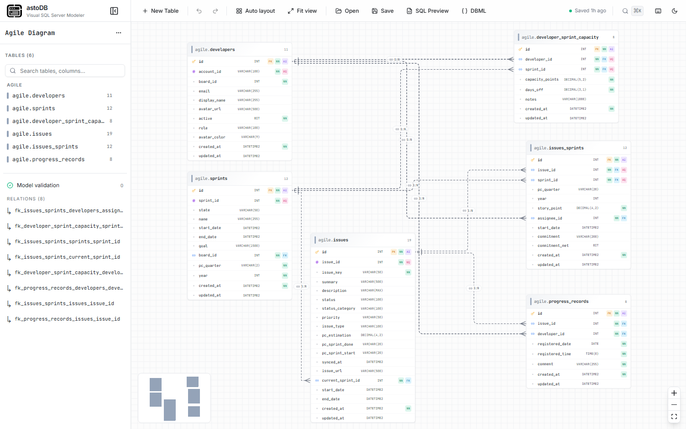

# astoDB — Visual SQL Server Modeler

**astoDB** is a professional, browser-based physical database modeling tool designed specifically for **Microsoft SQL Server**. It lets you design, visualize, and document relational database schemas through an interactive canvas, and generates ready-to-run **T-SQL DDL scripts** from your diagrams.

<div align="center">
  <br />
  <a href="https://franklinruiz.github.io/astodb/">
    
  </a>
  <br />
  <br />
  
  <p><em>A real-world schema (issues, sprints, developers) modeled end-to-end — tables, typed columns, crow's-foot relations, and validation, all on one canvas.</em></p>
</div>

---

## Features

### Canvas & Tables
- Interactive drag-and-drop canvas powered by React Flow
- Create tables from the toolbar or keyboard shortcut (`Ctrl/⌘ + N`)
- Table cards display `schema.tablename` in a single header line with the schema in muted color
- Color / module tag per table for visual grouping by domain or bounded context
- Column rows show name, data type, and constraint badges (PK, FK, NN, AI, UQ)
- Crow's Foot cardinality notation rendered above node layer (no z-order clipping)
- Mini-map, zoom, pan, snap-to-grid, and smooth navigation
- Auto layout (Dagre algorithm) with automatic viewport fit
- Multi-diagram workspace — create, rename, duplicate, and switch between diagrams

### Column Editor (Properties Panel)
- Native `<select>` for base SQL Server data types
- **Length / precision** field in the accordion — shown only for parameterized types:  
  `VARCHAR`, `NVARCHAR`, `CHAR`, `NCHAR`, `DECIMAL`, `NUMERIC`, `FLOAT`,  
  `VARBINARY`, `BINARY`, `TIME`, `DATETIME2`, `DATETIMEOFFSET`
- Toggle flags: Primary Key (PK), Foreign Key (FK), Unique (UQ)
- Extended attributes: Not Null, Auto Increment (IDENTITY), Default value, Comment
- Reorder columns up / down, delete columns
- All edits are performed exclusively in the Properties Panel — table nodes are read-only on the canvas

### Relations
- Draw a relation by dragging from the right handle of a source column to the left handle of a target column
- Quick-connect handle on the table header automatically picks the Primary Key column
- Supported cardinalities:
  - **One-to-One (1:1)**
  - **One-to-Many (1:N)**
  - **Many-to-Many (N:M)** — automatically generates a junction table with composite PK
- Smart FK creation: if the target column does not exist, a compatible FK column is created automatically
- Relation properties: type, ON DELETE, ON UPDATE, constraint name, label, source/target column reassignment
- Identifying vs. non-identifying relations (solid vs. dashed line)

### Model Validation
Real-time validation with severity indicators on table cards and the sidebar:

| Severity | Rule |
|----------|------|
| Warning  | Table has no Primary Key |
| Warning  | FK column not marked as FK in the relation |
| Error    | Primary Key column allows NULL |
| Error    | Duplicate column name in the same table |
| Error    | FK column has no relation (orphaned FK flag) |
| Error    | Relation references a column that no longer exists |
| Error    | Relation source is not a PK or UNIQUE column |
| Error    | Type mismatch between parent and child columns |

- ✅ Green checkmark when the model has zero issues
- ⚠️ Amber triangle when only warnings are present
- 🔴 Red circle when at least one error exists

### SQL Generation (T-SQL / Microsoft SQL Server)
- `SET QUOTED_IDENTIFIER ON` / `SET ANSI_NULLS ON` preamble
- `CREATE TABLE [schema].[name]` with bracket-quoted identifiers
- Inline `IDENTITY(1,1)` for auto-increment columns (`INT`, `BIGINT`, `SMALLINT`, `TINYINT`)
- `NOT NULL` / `NULL` constraints
- Inline `DEFAULT` values (numeric literals, SQL functions, and string literals)
- Named `PRIMARY KEY` constraint per table
- Named `UNIQUE` constraint per unique column
- Inline column comments via `/* comment */`
- `ALTER TABLE … ADD CONSTRAINT … FOREIGN KEY … REFERENCES` with `ON DELETE` / `ON UPDATE`
- `RESTRICT` is automatically converted to `NO ACTION` (the T-SQL equivalent)
- `GO` batch separators between statements

### Export Options
| Format | Description |
|--------|-------------|
| T-SQL script (.sql) | Ready-to-run DDL for SQL Server |
| Documentation PNG | High-contrast, tight-cropped image for docs / printing (3× pixel ratio, forced light theme) |
| SVG vector | Scalable vector export |

- **SQL Preview** dialog: view and copy the generated T-SQL without downloading
- **Save / Open project** (.json): persist the full diagram state and reopen it later

### Supported SQL Server Data Types
`INT` · `BIGINT` · `SMALLINT` · `TINYINT` · `BIT` · `DECIMAL` · `NUMERIC` · `MONEY` · `SMALLMONEY` · `FLOAT` · `REAL` · `NVARCHAR` · `VARCHAR` · `CHAR` · `NCHAR` · `DATE` · `TIME` · `DATETIME` · `DATETIME2` · `SMALLDATETIME` · `DATETIMEOFFSET` · `UNIQUEIDENTIFIER` · `XML` · `VARBINARY` · `BINARY` · `TEXT` · `NTEXT` · `IMAGE` · `SQL_VARIANT` · `HIERARCHYID` · `GEOMETRY` · `GEOGRAPHY`

---

## Keyboard Shortcuts

| Shortcut | Action |
|----------|--------|
| `Ctrl / ⌘ + N` | Create a new table |
| `Delete / Backspace` | Delete the selected table or relation |
| `Esc` | Deselect |
| `Drag` | Move tables on the canvas |
| `Drag from handle` | Create a relation between columns |
| `Mouse wheel` | Zoom in / out |
| `Space + drag` | Pan the canvas |

---

## Tech Stack

| Layer | Technology |
|-------|-----------|
| Framework | React 18 + TypeScript |
| Build | Vite |
| Canvas | `@xyflow/react` (React Flow v12) |
| State | Zustand (with localStorage persistence) |
| Styling | Tailwind CSS v3 + shadcn/ui (Radix UI primitives) |
| Layout algorithm | Dagre |
| Image export | `html-to-image` |
| Icons | `lucide-react` |
| IDs | `nanoid` |

---

## Architecture

```
src/
├── components/
│   ├── Canvas/
│   │   ├── Canvas.tsx          # ReactFlow wrapper, connection logic
│   │   ├── TableNode.tsx       # Read-only table card node
│   │   └── RelationEdge.tsx    # Crow's Foot edge with cardinality markers
│   ├── Properties/
│   │   └── PropertiesPanel.tsx # Table / column / relation editor panel
│   ├── Sidebar/
│   │   └── Sidebar.tsx         # Diagram nav, table list, validation summary
│   ├── Toolbar/
│   │   └── Toolbar.tsx         # Top action bar (new table, layout, export…)
│   └── UI/                     # shadcn/ui component library
├── constants/
│   └── index.ts                # App name, color palette, default values
├── hooks/
│   ├── use-keyboard-shortcuts.ts
│   └── use-theme.ts
├── store/
│   ├── diagram-store.ts        # Diagram state, all mutating actions
│   └── ui-store.ts             # Selection state, theme, panel visibility
├── types/
│   └── erd.ts                  # TypeScript types (Table, Column, Relation…)
└── utils/
    ├── export.ts               # PNG / SVG / JSON export, doc-mode capture
    ├── factories.ts            # createTable, createColumn, createRelationEdge…
    ├── flowInstance.ts         # Imperative ReactFlow instance singleton
    ├── sql-generator.ts        # T-SQL DDL generator
    └── validation.ts           # Model validation rules
```

---

## Installation

```bash
npm install
npm run dev
```

> **Node 24 / npm 11 issue:** If you see `Exit handler never called`, use Node 22 LTS or pnpm:
> ```bash
> corepack enable
> corepack prepare pnpm@latest --activate
> pnpm install
> pnpm dev
> ```

---

## Quick Start

1. Click **New Table** in the toolbar (or press `Ctrl/⌘ + N`) to add a table to the canvas.
2. Click the table card to open the **Properties Panel** on the right — edit the table name, schema, color, and columns there.
3. Add columns with the **+** button in the Properties Panel. Use the type selector and toggle PK / FK / UQ flags.
4. **Draw a relation**: drag from the right-side handle of a source column to the left-side handle of a target column.  
   The header handle auto-selects the Primary Key; column handles let you pick a specific column.
5. Change the relation to **N:M** in the Properties Panel to auto-generate the junction table.
6. Click **SQL Preview** to review the generated T-SQL, or use **Export → T-SQL script** to download it.
7. Click **Export → Documentation PNG** to get a high-contrast, print-ready ERD image.
8. Use **Save** to export the diagram as a `.json` project file and **Open** to reload it later.
